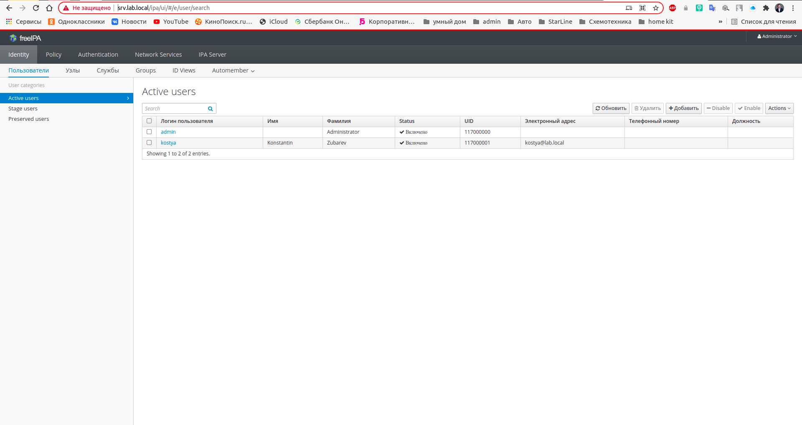
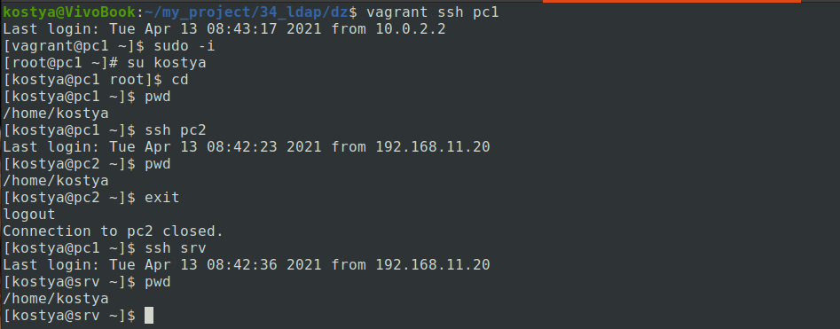

Стенд. Централизованная авторизация и аутентификация. LDAP.
===========================================================

Цель:

1. Установить FreeIPA;
2. Написать Ansible playbook для конфигурации клиента;
3. Настроить аутентификацию по SSH-ключам; 
4. Firewall должен быть включен на сервере и на клиенте.

Для демонстрации этого стенда, использую CentOS 7. Ниже приведены сведения о хостах.


|             |        SRV        |        PC1        |        PC2        |
|-------------|:-----------------:|:-----------------:|:-----------------:|
| IP          | 192.168.1.10/24   | 192.168.1.20/24   | 192.168.1.21/24   |
| FQDN        | srv.local.lab     | pc1.local.lab     | pc2.local.lab     |


Реализация.
-----------

Установите FreeIPA Server.
--------------------------

Необходимо произвести первоначальные настройки, указав имя FQDN хоста этого стенда. Без этого конфигурация сервера FreeIPA работать не будет.

```
[root@srv ~]# vi /etc/hosts

192.168.11.10    srv.local.lab    srv
```

Установим пакеты `ipa-server` и `ipa-server-dns` для настройки сервера FreeIPA. 
```
[root@srv ~]# yum install -y ipa-server ipa-server-dns
```

Настроим FreeIPA Server.
------------------------

Запустим конфигурацию центрального сервера индефикации FreeIPA.

```
[root@srv ~]# ipa-server-install
```

Настроим Firewalld.
-------------------

```
[root@srv ~]# systemctl enable --now firewalld
```
Настроим сервис firewalld

```
[root@srv ~]# firewall-cmd --permanent --zone=public --add-service={ldap,ldaps,dns}
[root@srv ~]# firewall-cmd --reload
[root@srv ~]# firewall-cmd --list-all --zone=public
```

Итак, настройка нашего центрального сервера идентификации FreeIPA успешно завершена.

Создать билет Kerberos.
-----------------------

Получим билет Kerberos с помощью команды `kinit admin`. Этот билет позволит нам использовать инструменты IPA.

```
[root@srv ~]# kinit admin
Password for admin@LAB.LOCAL:
```

Панель управления FreeIPA.
--------------------------

В браузере перейдем по адресу https://srv.lab.local/ipa/ui (user=admin; passwd=password).
> Необходимо прописать на хост машине в hosts адрес нашего сервера FreeIPA. 

```
192.168.11.10	srv.lab.local	srv
```


Установите FreeIPA Client.
--------------------------

Необходимо произвести первоначальные настройки, указав имя FQDN хоста и сервер имен.

```
[root@pc1 ~]# vi /etc/hosts

192.168.11.20    pc1.local.lab    pc1
```
```
[root@pc1 ~]# vi /etc/resolv.conf

search local.lab
nameserver 192.168.11.10
```
Установим пакет `ipa-client`. 
```
[root@pc1 ~]# yum install -y ipa-client
```
Конфигурирование клиента:

```
[root@pc1 ~]# ipa-client-install --mkhomedir
```

Настроим авторизацию по SSH ключам. Для этого на клиенской машине сгенирируем SSH-ключ.

```
[root@pc1 ~]# ssh-keygen
```

Далее выполним команду.

```
[root@pc1 ~]# cat ~/.ssh/id_rsa.pub
```
Выведенный ключ скопируем его и вставим в соответствующее поле у пользователя, в панели управления FreeIPA.

Проверим соединение c хостами `pc2`, `srv` через ключ ssh. 



Проверка задания
----------------

1. Выполнить `vagrant up`, и тестовый стент развернеться поносью.
> есть два playbook: `server.yum` и `client.yum`.

- [Установка и использование FreeIPA на CentOS](https://www.dmosk.ru/miniinstruktions.php?mini=freeipa-centos)
